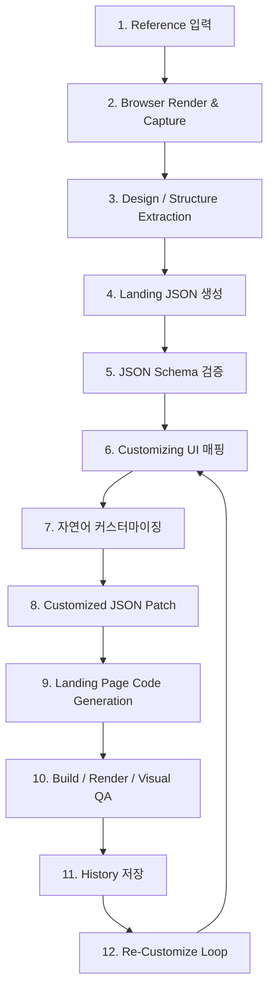
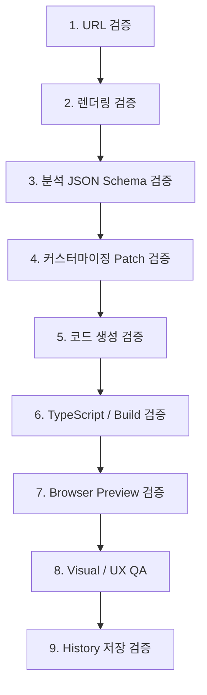
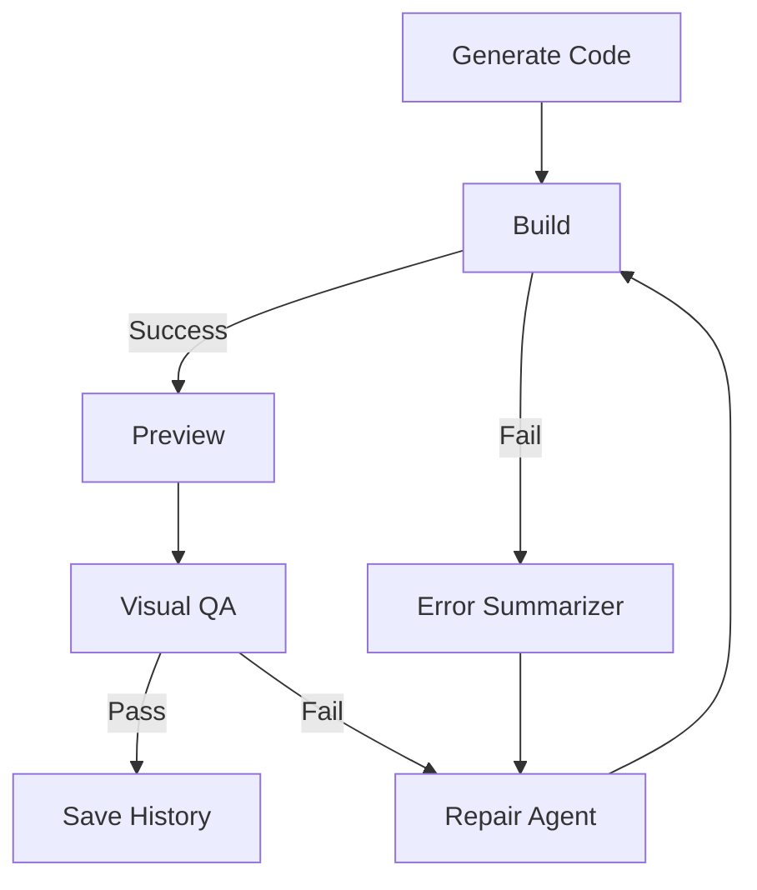

아래처럼 정리하시면 됩니다. 결론부터 말씀드리면, **첨부 교재의 핵심 방향은 적절합니다.** 다만 그대로 따라 하면 “개념 수업”에서 끝날 가능성이 있고, 선생님이 만들려는 `Landing Page Make from Reference`에는 **하네스 구조를 제품 파이프라인으로 번역하는 작업**이 필요합니다.

---

# 1. 첨부 교재 내용 검증

## 전체 평가

**적절성: 8/10**

교재는 하네스 엔지니어링을 단순히 “프롬프트 잘 쓰기”가 아니라, **에이전트가 표류하지 않고, 멈추지 않고, 데이터를 망가뜨리지 않고, 검증 가능한 결과로 수렴하게 만드는 실행 구조**로 설명하고 있습니다. Polysona 교재는 실패 모드를 `표류`, `조기 정지`, `데이터 파괴`, `예산 소진`으로 나누고, 이를 통제면·파이프라인·검증 사다리로 막는 구조를 제시합니다. 이 구분은 실제 에이전틱 개발에서 매우 유효합니다. 

특히 “루프를 계속 돌리는 것”과 “루프가 목표로 수렴하게 만드는 것”을 분리한 설명이 좋습니다. 베이스 루프 엔진은 추진력이고, 커스텀 레이어는 방향을 잡는 벽이라는 설명은 하네스의 본질을 잘 잡고 있습니다. 

win-hooks 교재도 좋습니다. 단순히 “작동했다”가 아니라 **존재 → 내용 → 실행 → from-scratch 재생성**까지 검증 사다리를 올라가는 방식이기 때문입니다. 이건 선생님이 만들 서비스에서도 그대로 써야 합니다. 예를 들어 “랜딩페이지가 생성됐다”가 아니라 “빌드된다 → 렌더링된다 → 구조 JSON과 일치한다 → 레퍼런스 특성이 반영된다 → 다시 커스터마이징 가능하다”까지 확인해야 합니다. 

---

## 좋은 점

첫째, **하네스를 통제면으로 설명한 점**이 좋습니다. Claude Code 공식 문서에서도 Hook은 세션 시작, 도구 실행 전후, 응답 종료 등 특정 라이프사이클 지점에서 실행되는 구조로 설명되며, `PreToolUse`는 도구 실행 전 차단, `PostToolUse`는 도구 실행 후 처리, `Stop`은 응답 완료 시점에 개입하는 식으로 이벤트 의미가 나뉩니다. 교재가 이 이벤트 의미에 맞춰 통제면을 배치한 것은 적절합니다. ([Claude Code][1])

둘째, **검증을 비용 순서로 사다리화한 점**이 좋습니다. Polysona 교재는 타입체크·빌드 같은 싼 검증을 먼저 하고, 브라우저 검증은 마지막에 두라고 설명합니다. 랜딩페이지 생성기에서도 이 원칙은 매우 중요합니다. 매번 브라우저를 띄워서 LLM이 확인하게 만들면 비용과 시간이 터집니다. 먼저 JSON Schema 검증, 코드 빌드, 정적 분석을 통과시킨 뒤에 브라우저 렌더링 검증으로 넘어가야 합니다. 

셋째, **win-hooks 교재의 “증거 기반 검증” 태도**가 좋습니다. “verify가 healthy라고 했으니 됐다”가 아니라, 직접 파일 내용을 보고, 실행해 보고, 부정 조건까지 확인합니다. 선생님 서비스에서도 “LLM이 분석 완료라고 말함”을 믿으면 안 되고, 실제 JSON 파싱, 스키마 검증, 빌드 결과, 스크린샷 결과를 증거로 남겨야 합니다. 

넷째, **디스크 상태와 런타임 상태가 다를 수 있다는 교훈**도 중요합니다. win-hooks 교재는 파일은 고쳐졌지만 실행 중인 세션 캐시가 옛 상태를 들고 있어 오류가 난 사례를 설명합니다. 이건 웹 생성기에서도 그대로 발생합니다. 예를 들어 DB에는 최신 JSON이 있는데, 프리뷰 iframe은 이전 빌드 결과를 보여줄 수 있습니다. 그래서 `analysis_version`, `customization_version`, `build_version`, `preview_version`을 분리해서 관리해야 합니다. 

---

## 보완해야 할 점

교재는 좋은데, 선생님 목표에 맞추려면 아래 보완이 필요합니다.

첫째, **“손 안 대고 완성”이라는 표현은 교육용으로는 강하지만, 제품 설계에서는 위험합니다.** 실제 서비스에서는 사용자의 커스터마이징, 레퍼런스 사이트 접근 실패, 동적 렌더링 실패, 이미지 저작권, 반응형 깨짐 같은 예외가 많습니다. 목표는 “손 안 대고 완성”이 아니라 **“중간중간 사람이 판단해야 하는 지점을 UI로 통제하고, 나머지는 자동화한다”**가 되어야 합니다.

둘째, Polysona 교재는 저장소 근거를 `파일:라인`으로 둔다고 말하지만, 첨부 교재만으로는 실제 공개 저장소의 각 파일 라인을 제가 독립 검증할 수는 없습니다. 따라서 수업 자료로는 좋지만, “재현 가능하다”는 주장은 실제 repo, commit hash, 실행 로그까지 같이 있어야 완전합니다. 첨부 교재 안에서도 일부 베이스 요소는 로컬 전용 또는 저장소 미포함이라고 구분되어 있습니다. 

셋째, Hook 중심 설명은 Claude Code 수업에는 좋지만, 선생님 서비스는 웹 제품입니다. 그러므로 Hook을 그대로 쓰기보다, 웹 서비스에서는 다음으로 치환해야 합니다.

| 수업의 하네스 요소            | 웹 제품에서의 대응                                    |
| --------------------- | --------------------------------------------- |
| SessionStart          | 프로젝트/런 생성 시 목표·제약 자동 주입                       |
| PreToolUse            | URL 접근 전/생성 전 정책 검사                           |
| PostToolUse           | 분석/생성 결과 검증                                   |
| Stop                  | 완료 조건 미충족 시 다음 단계 진행 차단                       |
| Sentinel              | `run.status`, `step.status`, `version`        |
| CLAUDE.md / AGENTS.md | `GOAL.md`, `SCHEMA.md`, `GENERATION_RULES.md` |
| 검증 사다리                | JSON 검증 → 빌드 → 렌더링 → 시각 비교 → 사용자 승인           |

넷째, `그대로 카피`는 제품 문구로 쓰면 위험합니다. 기능 내부적으로는 레퍼런스의 **레이아웃 구조, 시각적 리듬, 섹션 구성, 컬러 톤, 컴포넌트 패턴**을 분석하되, 실제 서비스 문구는 **Reference-inspired Landing Page Generator** 또는 **레퍼런스 기반 랜딩 재구성 도구**가 안전합니다.

---

# 2. 하네스 엔지니어링을 쉽게 다시 설명하면

하네스 엔지니어링은 이렇게 이해하시면 됩니다.

> **AI에게 “잘 만들어줘”라고 맡기는 것이 아니라, AI가 탈선하지 못하게 레일·벽·검문소·기록장치를 깔아두는 것**입니다.

즉, 하네스는 다음 5개입니다.

| 구성    | 쉬운 설명       | 선생님 서비스에서의 예                        |
| ----- | ----------- | ----------------------------------- |
| 목표    | 어디까지 가야 하는지 | 레퍼런스 기반 랜딩 생성                       |
| 상태    | 지금 어디까지 왔는지 | 입력 URL, 분석 JSON, 커스터마이징 JSON, 생성 코드 |
| 파이프라인 | 어떤 순서로 갈지   | 입력 → 분석 → 편집 → 생성 → 검증 → 히스토리       |
| 통제면   | 어디서 막고 보정할지 | URL 검증, JSON Schema, 빌드 실패 차단       |
| 검증    | 진짜 됐는지 확인   | 스키마 통과, 빌드 성공, 프리뷰 렌더링, 재커스터마이징 가능  |

---

# 3. `Landing Page Make from Reference` 제품 블루프린트

## 제품의 한 줄 정의

**사용자가 레퍼런스 URL을 입력하면, 해당 사이트의 디자인 시스템과 섹션 구조를 분석해 JSON으로 구조화하고, 사용자가 이를 자연어와 UI 컨트롤로 커스터마이징한 뒤, 새로운 랜딩페이지를 생성·저장·재수정할 수 있는 LLM 기반 랜딩 제작 도구**

---

# 4. 전체 흐름



---

# 5. 화면 구조

선생님이 말씀하신 것처럼, 이 서비스의 UI는 ChatGPT나 Claude 같은 LLM 서비스 구조를 레퍼런스로 삼는 게 좋습니다.

## 기본 레이아웃

```text
┌────────────────────────────────────────────────────────────┐
│ Header: Landing Page Make from Reference                   │
├───────────────┬───────────────────────────────┬────────────┤
│ History       │ Main Workspace                 │ Inspector  │
│               │                               │            │
│ - Run #12     │ Step 1: Reference Input        │ JSON       │
│ - Run #11     │ Step 2: Analysis Result        │ Controls   │
│ - Run #10     │ Step 3: Customize              │ Preview    │
│               │ Step 4: Make                  │            │
├───────────────┴───────────────────────────────┴────────────┤
│ Bottom Composer: “이 섹션을 더 애플처럼 바꿔줘…”             │
└────────────────────────────────────────────────────────────┘
```

## 화면 1. 레퍼런스 입력 단계

사용자가 레퍼런스 URL을 입력합니다.

필요 요소는 다음입니다.

| UI 요소      | 설명                               |
| ---------- | -------------------------------- |
| URL 입력 폼   | 레퍼런스 웹사이트 주소                     |
| 목적 입력      | “AI 강의 랜딩”, “SaaS 랜딩”, “병원 랜딩” 등 |
| 브랜드 정보 입력  | 브랜드명, 톤, 주요 CTA                  |
| Analyze 버튼 | 분석 시작                            |
| 진행 상태      | 접속 중, 렌더링 중, 캡처 중, 분석 중          |

이 단계의 하네스 검증은 단순합니다.

```text
URL 형식 검증
→ 접근 가능 여부 확인
→ robots/로그인/결제/차단 페이지 여부 확인
→ 렌더링 성공 여부 확인
→ 스크린샷 저장
```

---

## 화면 2. 레퍼런스 분석 JSON 구조화 단계

이 단계에서는 Playwright 같은 브라우저 렌더러로 실제 페이지를 열고, 다음을 수집합니다.

| 수집 항목            | 내용                                     |
| ---------------- | -------------------------------------- |
| Screenshot       | desktop/tablet/mobile                  |
| DOM 구조           | nav, section, card, footer             |
| Computed CSS     | font, color, spacing, radius, shadow   |
| Layout           | grid, flex, max-width, section gap     |
| Visual hierarchy | 가장 큰 타이포, CTA 위치, 이미지 배치               |
| Components       | hero, cards, pricing, FAQ, footer      |
| Assets           | 이미지 URL, 아이콘, 비디오 존재 여부                |
| Interaction      | sticky header, hover, scroll animation |

여기서 중요한 점은 LLM이 자유롭게 JSON을 만들게 두면 안 됩니다. OpenAI API에서는 Structured Outputs를 통해 JSON Schema에 맞는 구조화 출력을 만들 수 있고, JSON mode보다 schema adherence를 보장하는 방식이 권장됩니다. ([OpenAI 플랫폼][2])

따라서 분석 결과는 반드시 아래 같은 스키마로 고정해야 합니다.

```ts
type LandingReferenceAnalysis = {
  source: {
    url: string;
    title?: string;
    capturedAt: string;
    viewport: "desktop" | "tablet" | "mobile";
  };

  designSystem: {
    colors: {
      background: string[];
      text: string[];
      accent: string[];
      border: string[];
    };
    typography: {
      fontFamilies: string[];
      headingScale: string[];
      bodyScale: string[];
      weightPattern: string;
    };
    spacing: {
      sectionGap: string;
      containerWidth: string;
      cardGap: string;
      paddingPattern: string;
    };
    visualStyle: {
      mood: string[];
      density: "compact" | "balanced" | "spacious";
      radius: "sharp" | "soft" | "round";
      shadow: "none" | "subtle" | "strong";
      motion: string[];
    };
  };

  structure: {
    navigation?: SectionSpec;
    sections: SectionSpec[];
    footer?: SectionSpec;
  };

  risks: {
    copyrightRisk: string[];
    inaccessibleAssets: string[];
    dynamicContentIssues: string[];
  };
};
```

---

## 화면 3. JSON 커스터마이징 단계

이 화면이 제품의 핵심입니다.

분석된 JSON을 그대로 보여주면 사용자가 어렵습니다. 그러므로 JSON을 **폼/컨트롤러 UI로 맵핑**해야 합니다.

```text
왼쪽: 섹션 트리
가운데: 선택한 섹션 편집 폼
오른쪽: 실시간 프리뷰
하단: 자연어 커스터마이징 textarea
```

예를 들어 Hero 섹션을 선택하면 다음처럼 보여야 합니다.

| 컨트롤                   | 설명                                  |
| --------------------- | ----------------------------------- |
| Section Type          | Hero                                |
| Layout                | split / centered / asymmetrical     |
| Headline Style        | massive / editorial / minimal       |
| CTA Count             | 1개 / 2개                             |
| Background            | solid / gradient / image / abstract |
| Visual Density        | spacious / balanced / compact       |
| Remove Section        | 섹션 삭제                               |
| Duplicate Section     | 섹션 복제                               |
| Natural Language Edit | “이 히어로를 더 영화적으로 바꿔줘”                |

자연어 입력은 원본 JSON을 직접 바꾸는 게 아니라, **Patch JSON**을 생성해야 합니다.

```ts
type CustomizationPatch = {
  target: {
    sectionId?: string;
    path?: string;
  };
  instruction: string;
  operations: Array<{
    op: "add" | "replace" | "remove" | "move";
    path: string;
    value?: unknown;
    reason: string;
  }>;
};
```

이렇게 해야 사용자가 “이 섹션 없애줘”, “CTA를 하나 더 추가해줘”, “전체를 더 넓은 여백으로 바꿔줘”라고 말했을 때 추적 가능합니다.

---

## 화면 4. Make 단계

`Make` 버튼을 누르면 최종 JSON을 기준으로 랜딩페이지를 생성합니다.

여기서 생성 대상은 처음에는 **Next.js + Tailwind + shadcn/ui** 조합이 좋습니다. 선생님이 평소 쓰시는 스택과도 잘 맞습니다.

생성 결과는 다음을 포함해야 합니다.

| 산출물               | 설명                                 |
| ----------------- | ---------------------------------- |
| Generated Code    | `app/page.tsx`, components, styles |
| Preview URL       | iframe 또는 별도 preview route         |
| Build Log         | 성공/실패                              |
| Visual QA         | 원본 레퍼런스와 유사성 요약                    |
| Customization Log | 어떤 지시가 반영됐는지                       |
| Re-customize CTA  | 다시 수정하기                            |

---

# 6. 이 제품에 맞는 하네스 구조

## 6-1. SUT 정의

이 프로젝트에서 SUT, 즉 검증 대상은 다음입니다.

> **커스터마이징 JSON을 입력받아 랜딩페이지를 생성하는 전체 시스템**

즉, 단순히 LLM 출력이 아니라 아래 전체가 검증 대상입니다.

```text
URL 입력
→ 브라우저 렌더링
→ 디자인/구조 추출
→ JSON 생성
→ JSON 커스터마이징
→ 코드 생성
→ 빌드
→ 프리뷰
→ 히스토리 저장
→ 재커스터마이징
```

---

## 6-2. 실패 모드 정의

교재의 실패 모드를 선생님 제품에 맞추면 이렇게 됩니다.

| 실패 모드   | 제품에서 발생하는 문제       | 막는 방법                         |
| ------- | ------------------ | ----------------------------- |
| 표류      | 레퍼런스와 전혀 다른 랜딩 생성  | `GOAL.md`, 스키마, 디자인 토큰 고정     |
| 조기 정지   | 분석하다가 “정보 부족”으로 멈춤 | fallback 규칙, 부분 분석 허용         |
| 데이터 파괴  | 사용자가 수정한 JSON을 덮어씀 | versioning, patch 방식, history |
| 예산 소진   | 브라우저/LLM 호출 과다     | 단계별 캐싱, 싼 검증 먼저               |
| 저작권 리스크 | 원본 이미지/문구를 그대로 복사  | asset 금지, structure/style 재해석 |
| 렌더링 불일치 | JSON은 맞는데 화면이 깨짐   | build + screenshot QA         |
| 재수정 불가  | 생성 후 다시 편집 불가      | generated page도 JSON으로 연결     |

---

# 7. 에이전트/스킬 설계

이 서비스는 에이전트 하나가 다 하면 안 됩니다. 역할을 나누는 게 좋습니다.

## Agent 1. Reference Crawler

역할: URL 접속, 렌더링, 스크린샷, DOM 수집

검증 조건:

```text
- HTTP 200 또는 렌더링 성공
- desktop/tablet/mobile 캡처 완료
- 주요 visible text 추출
- DOM snapshot 저장
```

## Agent 2. Design Extractor

역할: 디자인 시스템 추출

추출 항목:

```text
- color palette
- typography
- spacing
- layout rhythm
- section density
- card style
- button style
- animation/motion hint
```

## Agent 3. Structure Mapper

역할: 페이지 구조 추출

추출 항목:

```text
- header
- hero
- problem section
- feature cards
- social proof
- pricing
- FAQ
- footer
```

## Agent 4. Customization Agent

역할: 사용자의 자연어 입력을 JSON Patch로 변환

예시:

```text
입력:
“히어로를 더 강렬하게 하고, 카드 섹션은 3개만 남겨줘.”

출력:
- hero.headingStyle = "massive"
- hero.visualMood = ["cinematic", "bold"]
- feature.sections[0].cards = first 3 only
```

## Agent 5. Code Generator

역할: 최종 JSON을 Next.js 코드로 생성

검증 조건:

```text
- TypeScript compile
- ESLint 통과
- Tailwind class 정상
- 사용하지 않는 import 없음
- hardcoded external copyrighted image 최소화
```

## Agent 6. QA Agent

역할: 생성 결과 검증

검증 조건:

```text
- npm build 성공
- preview render 성공
- 주요 섹션 수 일치
- CTA 존재
- 모바일 깨짐 없음
- history 저장 완료
```

---

# 8. 데이터 구조

## Run

```ts
type LandingRun = {
  id: string;
  status:
    | "created"
    | "capturing"
    | "analyzing"
    | "customizing"
    | "generating"
    | "verifying"
    | "completed"
    | "failed";

  input: {
    referenceUrl: string;
    userGoal: string;
    brandName?: string;
    brandDescription?: string;
  };

  versions: {
    analysisVersion: number;
    customizationVersion: number;
    generationVersion: number;
  };

  createdAt: string;
  updatedAt: string;
};
```

## History

```ts
type LandingHistoryItem = {
  id: string;
  runId: string;
  referenceUrl: string;
  thumbnailUrl: string;
  title: string;
  status: string;
  latestPreviewUrl?: string;
  createdAt: string;
};
```

## SectionSpec

```ts
type SectionSpec = {
  id: string;
  type:
    | "header"
    | "hero"
    | "feature"
    | "cards"
    | "testimonial"
    | "pricing"
    | "faq"
    | "footer"
    | "custom";

  label: string;
  order: number;
  enabled: boolean;

  layout: {
    mode: "centered" | "split" | "grid" | "asymmetric" | "stacked";
    maxWidth: string;
    spacing: string;
    alignment: string;
  };

  content: {
    eyebrow?: string;
    headline?: string;
    body?: string;
    ctas?: Array<{
      label: string;
      href: string;
      variant: "primary" | "secondary" | "ghost";
    }>;
    items?: Array<Record<string, unknown>>;
  };

  style: {
    background: string;
    textColor: string;
    accentColor?: string;
    radius?: string;
    shadow?: string;
  };
};
```

---

# 9. 검증 사다리

이 제품에서 가장 중요한 하네스는 검증 사다리입니다.



각 단계의 완료 조건은 명확해야 합니다.

| 단계         | 통과 조건                          |
| ---------- | ------------------------------ |
| URL 검증     | 접근 가능, HTML 또는 렌더링 결과 존재       |
| 렌더링 검증     | screenshot 1개 이상 생성            |
| JSON 검증    | schema parse 성공                |
| Patch 검증   | 원본 JSON에 적용 가능                 |
| 코드 생성 검증   | 파일 생성 완료                       |
| Build 검증   | `npm run build` 성공             |
| Preview 검증 | iframe 또는 preview URL 정상       |
| UX QA      | 주요 섹션, CTA, 모바일 확인             |
| History 검증 | run, input, output, preview 저장 |

---

# 10. 실제 개발 순서

## Step 1. `GOAL.md` 작성

먼저 에이전트가 절대 잊으면 안 되는 목표를 문서로 만드셔야 합니다.

```md
# GOAL.md

이 프로젝트는 레퍼런스 웹사이트의 디자인 구조와 시각적 패턴을 분석하여,
사용자가 커스터마이징 가능한 JSON으로 변환하고,
그 JSON을 기반으로 새로운 랜딩페이지를 생성하는 도구다.

원본 사이트의 이미지, 문구, 로고, 고유 브랜드 자산을 그대로 복사하지 않는다.
레이아웃, 섹션 구성, 시각적 리듬, 디자인 토큰을 참고하여 새로운 랜딩을 생성한다.

완료 조건:
1. URL 입력 가능
2. 레퍼런스 렌더링 및 캡처 가능
3. 분석 JSON 생성 가능
4. JSON을 UI로 편집 가능
5. 자연어 입력으로 JSON Patch 가능
6. Make 버튼으로 랜딩 생성 가능
7. 생성 결과 preview 가능
8. 모든 입력/분석/생성 결과 history 저장
9. 생성된 랜딩을 다시 customize 가능
```

---

## Step 2. JSON Schema부터 고정

코드 생성보다 먼저 해야 할 일은 JSON Schema입니다.

이유는 간단합니다.

> JSON Schema가 없으면 LLM이 매번 다른 구조를 만들고, UI 매핑도 깨지고, 재커스터마이징도 불가능해집니다.

OpenAI의 Structured Outputs는 `json_schema`와 `strict: true` 같은 방식으로 모델 출력을 스키마에 맞게 제한할 수 있으므로, 이 프로젝트에서는 필수에 가깝습니다. ([OpenAI 플랫폼][2])

---

## Step 3. LLM 서비스형 UI Shell 만들기

먼저 실제 기능보다 화면 뼈대를 만드셔야 합니다.

필수 UI:

```text
- 좌측 History Sidebar
- 중앙 Main Workspace
- 우측 JSON / Inspector Panel
- 하단 Natural Language Composer
- 단계별 Progress Timeline
```

이 단계에서는 아직 실제 분석이 안 되어도 됩니다. mock JSON으로 화면을 먼저 만드세요.

---

## Step 4. Reference Capture Worker 만들기

Playwright 기반으로 URL을 렌더링합니다.

저장해야 할 것:

```text
/runs/{runId}/capture/desktop.png
/runs/{runId}/capture/tablet.png
/runs/{runId}/capture/mobile.png
/runs/{runId}/capture/dom.json
/runs/{runId}/capture/computed-style.json
/runs/{runId}/capture/metadata.json
```

---

## Step 5. Design Extractor 만들기

브라우저에서 가져온 DOM, screenshot, computed style을 바탕으로 디자인 요소를 추출합니다.

처음부터 완벽하게 하지 말고 MVP에서는 아래만 하시면 됩니다.

```text
- 대표 배경색 3~5개
- 대표 텍스트 색상 3~5개
- CTA 색상
- font-family
- heading 크기
- section gap
- container max-width
- border radius
- card shadow
- section 목록
```

---

## Step 6. Structure Mapper 만들기

DOM을 섹션 단위로 나눕니다.

처음 MVP에서는 휴리스틱으로 충분합니다.

```text
header/nav 태그 → header
첫 번째 큰 h1 영역 → hero
반복 card grid → feature/cards
가격 숫자/plan 키워드 → pricing
question/faq 키워드 → faq
footer 태그 → footer
```

그다음 LLM에게 넘겨서 구조화합니다.

---

## Step 7. Customization UI 만들기

분석 JSON을 사용자가 직접 만질 수 있게 만듭니다.

필수 기능:

```text
- 섹션 이름 변경
- 섹션 순서 변경
- 섹션 삭제
- 섹션 복제
- headline/body/CTA 수정
- 색상 수정
- spacing 수정
- layout mode 변경
- 자연어 textarea로 수정
```

---

## Step 8. Natural Language Patch 만들기

사용자가 textarea에 입력하면 원본 JSON 전체를 다시 생성하지 말고, Patch만 생성합니다.

```text
사용자:
“Hero는 더 강렬하게, 카드 섹션은 4개에서 3개로 줄이고, 전체 여백을 더 넓게 해줘.”

LLM 출력:
[
  { "op": "replace", "path": "/sections/hero/style/mood", "value": ["bold", "cinematic"] },
  { "op": "replace", "path": "/sections/features/items", "value": ["first 3 items"] },
  { "op": "replace", "path": "/designSystem/spacing/sectionGap", "value": "wide" }
]
```

---

## Step 9. Code Generator 만들기

최종 JSON을 기준으로 Next.js 코드를 생성합니다.

처음에는 자유 생성보다 **템플릿 기반 생성**이 안전합니다.

```text
SectionSpec.type === "hero" → HeroSection.tsx
SectionSpec.type === "feature" → FeatureSection.tsx
SectionSpec.type === "pricing" → PricingSection.tsx
SectionSpec.type === "faq" → FAQSection.tsx
```

LLM은 전체 파일을 매번 새로 쓰는 역할보다, JSON을 보고 적절한 props를 채우는 역할부터 맡기는 게 안정적입니다.

---

## Step 10. Build & Preview 검증

생성 후 바로 아래를 실행합니다.

```text
npm run typecheck
npm run build
preview render
screenshot capture
mobile viewport check
```

실패하면 사용자에게 “실패”라고 보여주는 게 아니라, QA Agent가 수정 루프를 한 번 돌게 해야 합니다.



---

## Step 11. History 저장

히스토리는 단순 목록이 아니라, 재현 가능한 작업 기록이어야 합니다.

저장할 것:

```text
- 입력 URL
- 입력 목적
- 원본 screenshot
- 분석 JSON
- customization patch 목록
- 최종 JSON
- 생성 코드 snapshot
- preview screenshot
- build log
- QA result
```

이렇게 해야 나중에 “어제 만든 거 다시 수정”이 가능합니다.

---

## Step 12. Re-Customize Loop 만들기

생성된 랜딩페이지 아래에 다시 textarea를 붙입니다.

예:

```text
“이 랜딩을 더 프리미엄하게 바꿔줘”
“CTA 버튼을 상단에 하나 더 추가해줘”
“강의 소개 섹션을 가격표 위로 올려줘”
“전체를 다크모드로 바꿔줘”
```

이 입력은 다시 `CustomizationPatch`로 변환되고, 최종 JSON에 적용된 뒤 재생성됩니다.

---

# 11. 추천 기술 스택

선생님 기준으로는 아래가 가장 현실적입니다.

| 영역             | 추천                                                  |
| -------------- | --------------------------------------------------- |
| Frontend       | Next.js App Router, TypeScript, Tailwind, shadcn/ui |
| Backend API    | Next.js Route Handler 또는 FastAPI                    |
| Browser Render | Playwright                                          |
| Queue          | BullMQ + Redis                                      |
| DB             | PostgreSQL + Prisma                                 |
| Storage        | S3 호환 스토리지 또는 로컬 `/runs`                            |
| LLM            | OpenAI API Structured Outputs                       |
| Preview        | iframe + isolated route                             |
| Code Sandbox   | Docker 또는 isolated workspace                        |
| History        | PostgreSQL + file snapshot                          |
| QA             | typecheck, build, screenshot, schema validation     |

---

# 12. MVP 범위

처음부터 완성형으로 만들면 너무 큽니다. MVP는 아래까지만 잡는 게 좋습니다.

## MVP 1차

```text
1. URL 입력
2. Playwright로 screenshot + DOM 수집
3. LLM으로 LandingReferenceAnalysis JSON 생성
4. JSON을 화면에 카드 형태로 표시
5. textarea로 JSON 수정
6. Make 버튼으로 단일 page.tsx 생성
7. preview 표시
8. history 저장
```

## MVP 2차

```text
1. 섹션별 컨트롤러 UI
2. 섹션 삭제/순서 변경
3. JSON Patch 기반 자연어 수정
4. 모바일 preview
5. build 실패 자동 수정
```

## MVP 3차

```text
1. 여러 레퍼런스 조합
2. 브랜드 가이드 입력
3. Figma export
4. 컴포넌트 라이브러리화
5. 배포 버튼
```

---

# 13. 바로 해야 할 행동 순서

가장 먼저 하실 일은 이 순서입니다.

```text
1. GOAL.md 작성
2. LandingReferenceAnalysis JSON Schema 작성
3. CustomizationPatch JSON Schema 작성
4. Next.js UI Shell 생성
5. History Sidebar + Main Workspace + Inspector + Bottom Composer 구현
6. Playwright capture API 구현
7. mock analysis JSON으로 커스터마이징 화면 구현
8. OpenAI Structured Outputs로 분석 JSON 생성
9. JSON Patch 자연어 수정 구현
10. JSON → Next.js page 생성기 구현
11. npm build 검증 루프 구현
12. preview + history 저장 구현
```

---

# 14. 핵심 결론

교재에서 배워야 할 핵심은 “훅을 어떻게 쓰느냐”가 아닙니다.

진짜 핵심은 이것입니다.

> **AI가 자유롭게 일하게 두지 말고, 목표·상태·파이프라인·검증·히스토리를 먼저 깔아둔 뒤 그 안에서만 일하게 만드는 것.**

선생님의 `Landing Page Make from Reference`는 하네스 엔지니어링 수업에 아주 잘 맞는 실습 주제입니다. 다만 제품 설계의 핵심은 “레퍼런스를 그대로 복사하는 AI”가 아니라, **레퍼런스를 구조화하고, 안전하게 변형하고, 검증 가능한 랜딩페이지로 재생성하는 하네스**입니다.

[1]: https://code.claude.com/docs/en/hooks "Hooks reference - Claude Code Docs"
[2]: https://platform.openai.com/docs/guides/structured-outputs "Structured model outputs | OpenAI API"
